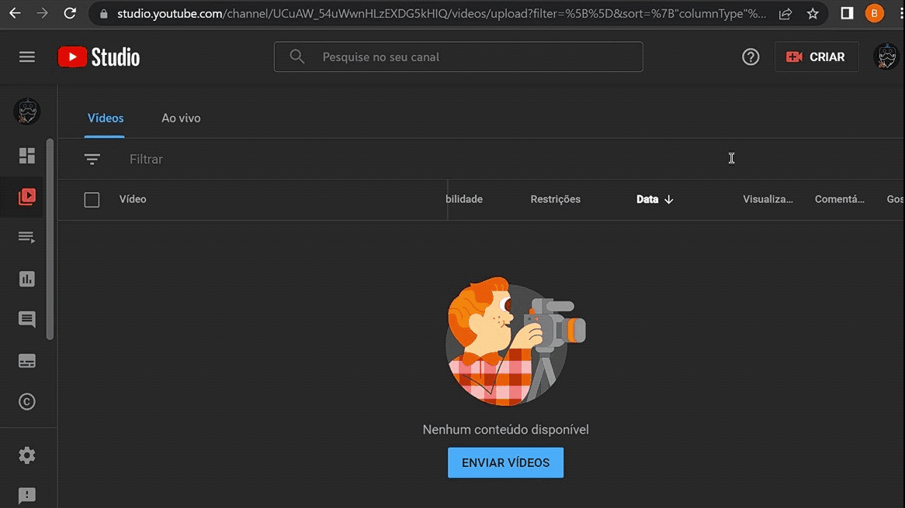

Tabela de conteúdos
=================
<!--ts-->
   * [Sobre](#🤖-sobre)
   * [Features](#✅-features)
   * [Tecnologias](#🛠-tecnologias)
   * [Como executar o projeto](#🚀-como-executar-o-projeto)
   * [Execução do bot: automação única vs massiva](#automação-única)
   * [Como contribuir para o projeto](#💖-como-contribuir-para-o-projeto)
   * [Licença](#📝-licença)

## 🤖 Sobre 

O Podcast Automation é um RPA criado para agilizar o processo de cortes dos canais do YouTube que trabalham com podcast. O bot realiza o download, edição (cortes) e upload para o YouTube.

## ✅ Features
- [x] Automação única
- [x] Automação massiva 
- [ ] Escolher thumbnail 

## 🛠 Tecnologias

- [Click](https://palletsprojects.com/p/click/)
- [Pytube](https://pytube.io/en/latest/index.html)
- [MoviePy](https://zulko.github.io/moviepy/)
- [YouTube API](https://developers.google.com/youtube/v3/guides/uploading_a_video)

## 🚀 Como executar o projeto

Antes de começar, você vai precisar ter instalado em sua máquina as seguintes ferramentas: 
- [Git](https://git-scm.com)
- [Python 3.9](https://www.python.org/downloads/) 

<br>

Com os pré-requisitos atendidos, basta clonar o repositório e instalar as dependências:
```
$ git clone podcastautomation

$ pip install -r requirements.txt
```

<br>

Para utilizarmos a API de upload do YouTube, precisaremos criar as credenciais no Google Cloud seguindo os passos abaixo:

1. Criar projeto no [Google Cloud](https://console.cloud.google.com):

    
    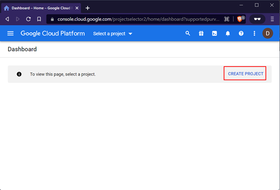
    

<br>

2. Habilitar o YouTube API para o projeto criado:
    
   
    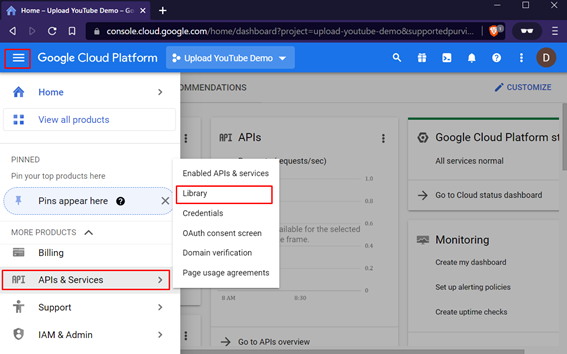
    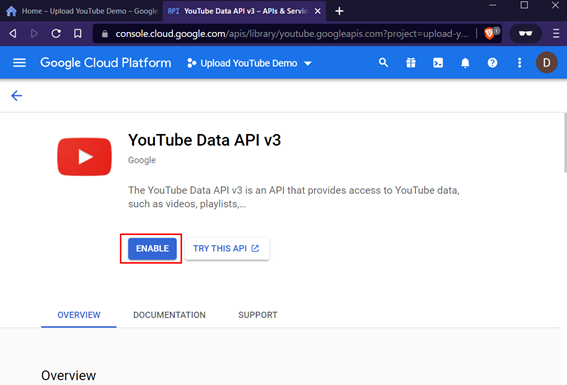

<br>
 
3. Configurar tela de consentimento:

      
    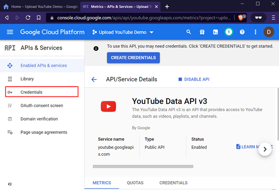
    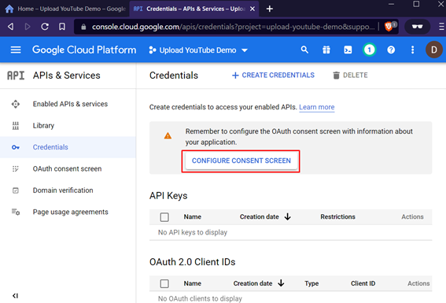
    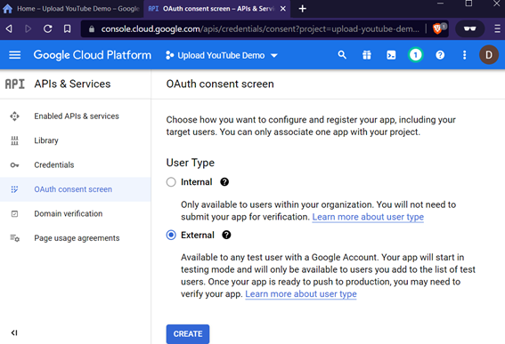
    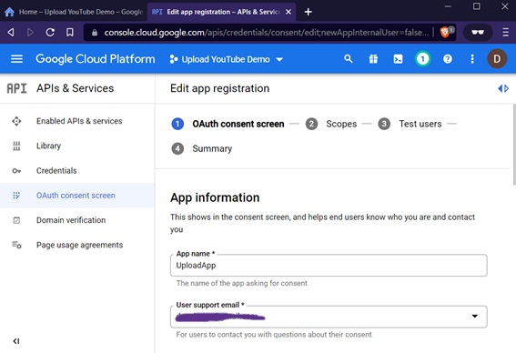
    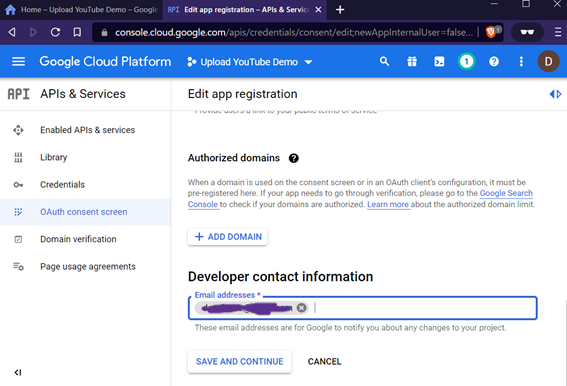

<br>

4. Selecionar o escopo:

    
    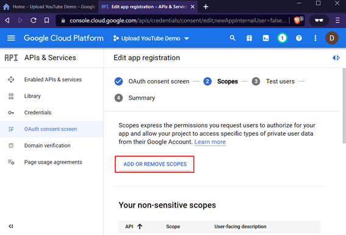
    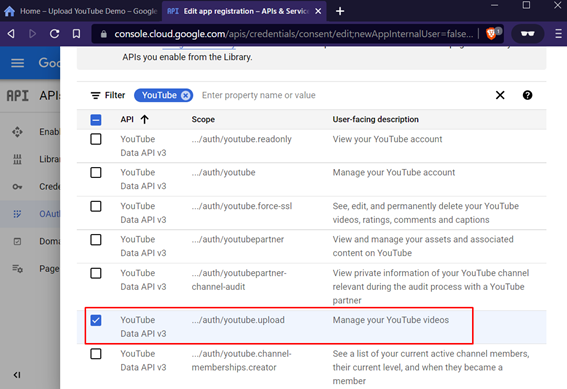

<br>

5. Inserir usuário de teste:
    

     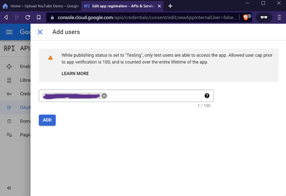

<br>

6. Criar credenciais:


      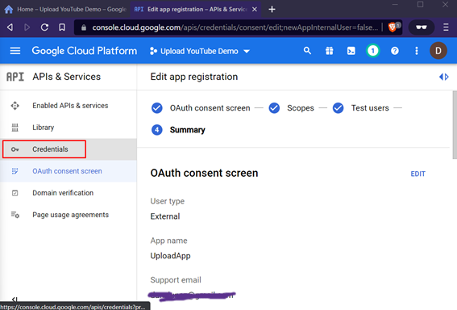
      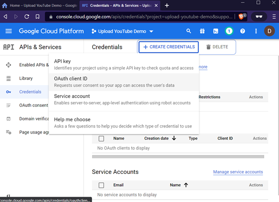
      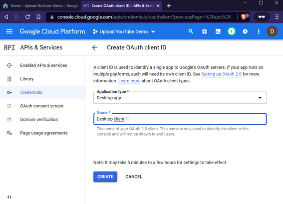
      

<br>

Finalize o processo configurando no arquivo youtube/client_secrets.json o **client_id** e o **client_secret** criados anteriormente:
```
{
  "web": {
    "client_id": "",
    "client_secret": "",
    "redirect_uris": [],
    "auth_uri": "https://accounts.google.com/o/oauth2/auth",
    "token_uri": "https://accounts.google.com/o/oauth2/token"
  }
}
```

### Automação única
Apenas um vídeo do YouTube pode ser automatizado.

<br>

Argumentos:
- **-u, --url**: url do vídeo para download.

- **-r, --ranges**: agrupamento dos intervalos (início, fim) dos cortes. Ex:
                     5, 10, 15, 25.

<br>

Argumentos opcionais:
- **-as, --name**: nome do vídeo que será baixado.

- **-h, --highest**: indica que o conteúdo do YouTube deverá ser baixado com a maior qualidade disponível.

<br>

```
$ botcast -u https://www.youtube.com/watch?v=mjTh2dMyVVc -r 788,815,320,370

$ botcast -u https://www.youtube.com/watch?v=mjTh2dMyVVc -r 788,815,320,370 -as cariani-flow -h
```

### Automação massiva
Mais de um vídeo do YouTube pode ser automatizado.

<br>

Cria o arquivo "automation_data.json" onde os vídeos serão configurados:
```
$ mbotcast-init
```

```
{
    "videos": [
        {
            "url": "[url do vídeo]",
            "ranges": "[início do corte, fim do corte]",
            "name": "[nome do vídeo]",
            "highest": "[máxima qualidade]"
        }
    ]
}
```

Exemplo:

```
{
    "videos": [
        {
            "url": "https://www.youtube.com/watch?v=mjTh2dMyVVc",
            "ranges": "929,973,788,815",
            "name": "exemplo1",
            "highest": true
        },
        {
            "url": "https://www.youtube.com/watch?v=pKO9UjSeLew",
            "ranges": "0, 46, 86, 181,",
            "name": "exemplo2",
            "highest": false
        }
    ]
}
```

<br>

Inicia a automação massiva:
```
$ mbotcast
```
## 💖 Como contribuir para o projeto

1.  Faça um **fork** do projeto.
2.  Crie uma nova branch com as suas alterações: `git checkout -b my-feature`
3.  Salve as alterações e crie uma mensagem de commit contando o que você fez: `git commit -m "feature: My new feature"`
4.  Envie as suas alterações: `git push origin my-feature`

> Caso tenha alguma dúvida confira este [guia de como contribuir no GitHub](https://github.com/firstcontributions/first-contributions)

## 📝 Licença

Este projeto está sob a licença MIT.

### Autor
---

<a href="https://avatars.githubusercontent.com/u/65408734?s=400&u=230243e2beb13503eeb96877ee98161a91708524&v=4">
 
 <br />
 <sub><b>Daniel Luna</b></sub></a> <a href="https://www.linkedin.com/in/daniel-luna-a8401b1ba/" title="">♓</a>


Feito com ❤️ por Daniel Luna

[](https://www.linkedin.com/in/daniel-luna-a8401b1ba/) 
[](https://www.instagram.com/zdanielluna/)

